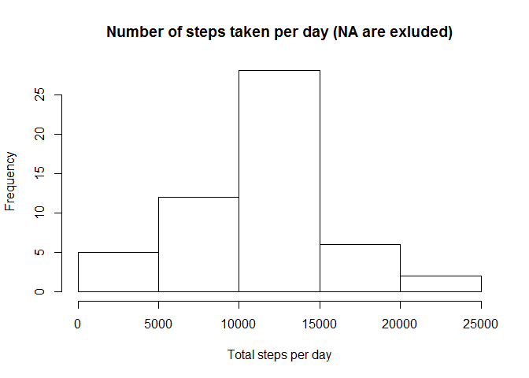
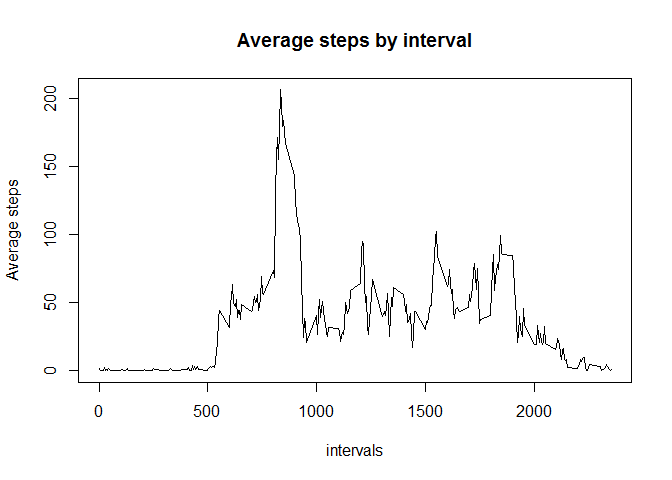
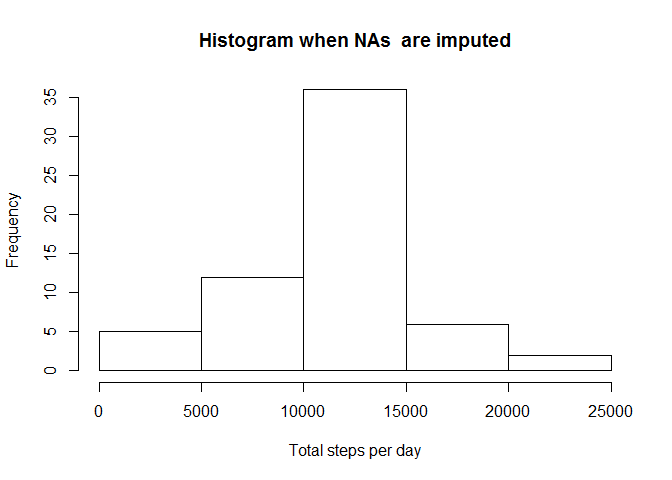
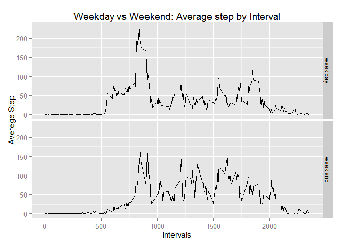

# Reproducible Research: Peer Assessment 1


```r
library(plyr)
library(dplyr)
library(data.table)
library(ggplot2)
```

## Loading and preprocessing the data


```r
##setwd("setup_path_to_working_directory_to_execute_data_read")
data <- read.table(unz("activity.zip", "activity.csv"), header=T,  sep=",")
close(unz("activity.zip", "activity.csv"))
data <-data.table(data)
```


## What is mean total number of steps taken per day?

```r
##Exclude Nas for this exercise
dataNa <- data[!is.na(data$steps),]

#Summarize dataset. Calculate total number of steps per day
stepsPerDay <- summarize(group_by(dataNa, date), sum(steps))
setnames(stepsPerDay, "sum(steps)", "colstepsPerDay")
head(stepsPerDay,5)
```

```
##         date colstepsPerDay
## 1 2012-10-02            126
## 2 2012-10-03          11352
## 3 2012-10-04          12116
## 4 2012-10-05          13294
## 5 2012-10-06          15420
```

```r
#create histogram
hist(stepsPerDay$colstepsPerDay, xlab="Total steps per day",  main='Number of steps taken per day (NA are exluded)')
```

 

```r
#mean and median
average <- mean(stepsPerDay$colstepsPerDay)
med <- median(stepsPerDay$colstepsPerDay)

cat("Average is equal to: ", average, " Median is equal to: ", med  )
```

```
## Average is equal to:  10766.19  Median is equal to:  10765
```


## What is the average daily activity pattern?

```r
##Average by interval
meanSteps <- summarize(group_by(dataNa, interval), mean(steps))
setnames(meanSteps, "mean(steps)", "meanSteps")

##Create line plot
plot(meanSteps$interval, meanSteps$meanSteps, type='l', 
     xlab='intervals',
     ylab = 'Average steps',
     main= 'Average steps by interval'
     )
```

 

```r
## Which inteval has the highest average?

cat("Interval: " ,meanSteps$interval[which.max(meanSteps$meanSteps)])
```

```
## Interval:  835
```


## Imputing missing values


```r
## How many NAs in the dataset?
cat("Number of NAs: ", sum(is.na(data$steps)))
```

```
## Number of NAs:  2304
```

```r
##Logic to Impute NAs
##=====================================================================================
##Short Description:
##  use average by interval as filling value for NAs rounded and casted to integer value.
##  For example value < 0.5 will be = 0; Value = 0.6 will be = 1 
##=====================================================================================

##Create dataset with new imputed steps per day
impute.mean <- function(x) replace(x, is.na(x), round(mean(x, na.rm = TRUE)))
dataTr <- ddply(data, ~ interval, transform, steps.impute = as.integer(impute.mean(steps)))
dataTr <- dataTr[order(dataTr$date, dataTr$interval),]
dataTr <- data.table(dataTr)

#Data Sample
head(dataTr,5)
```

```
##    steps       date interval steps.impute
## 1:    NA 2012-10-01        0            2
## 2:    NA 2012-10-01        5            0
## 3:    NA 2012-10-01       10            0
## 4:    NA 2012-10-01       15            0
## 5:    NA 2012-10-01       20            0
```


##### Differences


```r
dataTrGrp <- summarize(group_by(dataTr, date), sum(steps.impute))
setnames(dataTrGrp, "sum(steps.impute)", "colstepsPerDay")

## Histogram
hist(dataTrGrp$colstepsPerDay,
      xlab="Total steps per day",
     main = "Histogram when NAs  are imputed")
```

 

```r
## Mean/Median Differences
```


```r
cat ("Mean when NAs are exluded: ", mean(stepsPerDay$colstepsPerDay))
```

```
## Mean when NAs are exluded:  10766.19
```

```r
cat ("Mean when NAs are imputed using the average of interval: ",  mean(dataTrGrp$colstepsPerDay) )
```

```
## Mean when NAs are imputed using the average of interval:  10765.64
```

```r
cat ("Difference in Mean: " , mean(stepsPerDay$colstepsPerDay) - mean(dataTrGrp$colstepsPerDay))
```

```
## Difference in Mean:  0.549335
```

```r
cat ("Median when NA are exluded: ", median(stepsPerDay$colstepsPerDay) )
```

```
## Median when NA are exluded:  10765
```

```r
cat ("Mean when NA are imputed using the average of interval: ",  median(dataTrGrp$colstepsPerDay) )
```

```
## Mean when NA are imputed using the average of interval:  10762
```

```r
cat ("Difference in Median: " ,median(stepsPerDay$colstepsPerDay) - median(dataTrGrp$colstepsPerDay))
```

```
## Difference in Median:  3
```


## Are there differences in activity patterns between weekdays and weekends?


```r
##Prepare data
weekday.f <- function (x) ifelse(x %in% c('Saturday', 'Sunday'), 'weekend', 'weekday') 

dataTr$days <- weekdays(as.Date(dataTr$date))
dataTr$weekend.weekday <- as.factor(weekday.f(weekdays(as.Date(dataTr$date))))

#Data sample
head(dataTr,5)
```

```
##    steps       date interval steps.impute   days weekend.weekday
## 1:    NA 2012-10-01        0            2 Monday         weekday
## 2:    NA 2012-10-01        5            0 Monday         weekday
## 3:    NA 2012-10-01       10            0 Monday         weekday
## 4:    NA 2012-10-01       15            0 Monday         weekday
## 5:    NA 2012-10-01       20            0 Monday         weekday
```


```r
##group data 
weekDayDF <- summarize(group_by(dataTr, interval, weekend.weekday), mean(steps.impute))
setnames(weekDayDF, "mean(steps.impute)", "meanSteps")

#plot data
qplot(interval, meanSteps,
      data=weekDayDF,
      facets=weekend.weekday~.,
      geom = "line",
      ylab = "Averege Step",
      xlab = "Intervals",
      main = "Weekday vs Weekend: Average step by Interval")  
```

 
